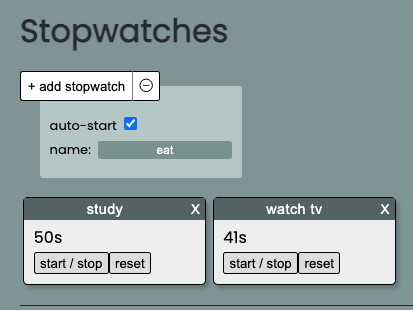
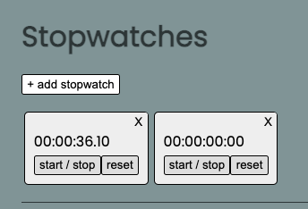
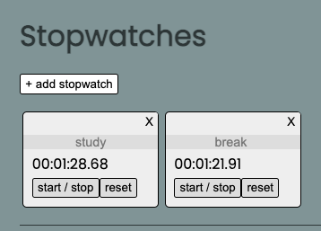
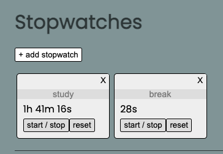
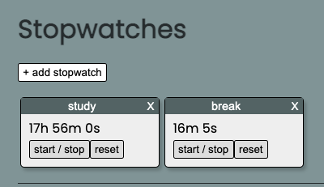

# [Stopwatches](https://stopwatches.netlify.app/)



## Description

Keep track of how long all your tasks are taking with multiple stopwatches! Just click to add a new stopwatch. Stopwatches can be run simulaneously. Each stopwatch can be given a unique name too!

## Technologies

HTML, CSS, JavaScript, Local Storage

## How My Stopwatch Works In Code

A stopwatch needs certain variables to work with...

- startTime
  - the time when the stopwatch was started. If you subtract the current time from the start time, then you get the elapsed time! If pauses did not exist, then that would be it...
- pauseTime
  - the time when the stopwatch was paused. Works with:
- elapsedPauseTime
  - the sum of all the paused durations. When you pause a stopwatch, pauseTime is assigned to the current time. When a stopwatch is continued after a pause, it will subtract the pauseTime from the current time. The resultant duration is how long the last pause took. It gets added to elapsedPauseTime.
    To put it all together, the code for continuously updating an active stopwatch is...

```
//simplified code:
  //if a stopwatch is started, and pauseTime exists:
  if (pauseTime) {
    elapsedPauseTime += Date.now() - pauseTime;
    pauseTime = null;
  }
  //continuously update elapsed time:
  setInterval(() => {
    const elapsedTime = Date.now() - startTime - elapsedPauseTime;
    displayEl.textContent = format(elapsedTime);
  }, 20);
```

## Tasks

- [x] a user can click a button to create as many stopwatches as desired
- [x] a user can refresh the page and still see stopwatches (local storage)
- [x] a user can delete stopwatches
- [x] a user can give each stopwatch a name
- [ ] a user can check a box to see milliseconds (eg. 56.4s instead of 56s)
- [ ] a user can click a drag a stopwatch to reorder it
- [ ] make running stopwatches brighter than paused stopwatches

## Problems


### Blank Button (Mobile Device) SOLVED

The button appears blank when accessed from my iPhone 12 mini, on Safari and Chrome.
FIX: added `color: black` to .add-btn

## Thoughts

- Increased Comfort Using Git
  - I enjoyed creating new branches before working on new features. This way, if my implementation of a feature fails, then I can simply delete the feature branch, leaving the other branches untouched.

## Evolution


- single stopwatch
- hard-coded HTML


- dynamically generated HTML based on array of stopwatch objects


- click to create desired amount of stopwatches


- restyled



- adds X button to delete a stopwatch



- name-able stopwatches



- changed display format for increased readability



- restyled: name-input and delete-btn is separate from body, like a typical file explorer window


- adds add-stopwatch options
