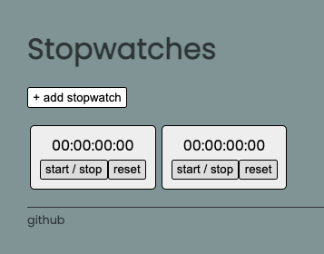
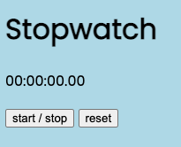
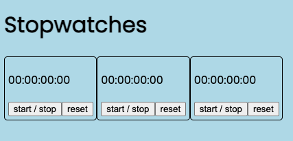
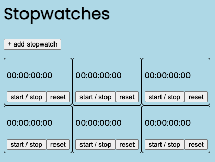

# [Stopwatches](https://stopwatches.netlify.app/)

## Description

Click to add as many stopwatches as you like!

## Technologies

HTML, CSS, JavaScript

## User Stories

- a user can delete stopwatches
- a user can name stopwatches
- a user can refresh the page and still see stopwatches (local storage)
- change displayed elapsed time format
- ~~a user can click a button to create as many stopwatches as desired~~

## Evolution

- single stopwatch
- hard-coded HTML

- dynamically generated HTML based on array of stopwatch objects

- click to create desired amount of stopwatches

- restyled
